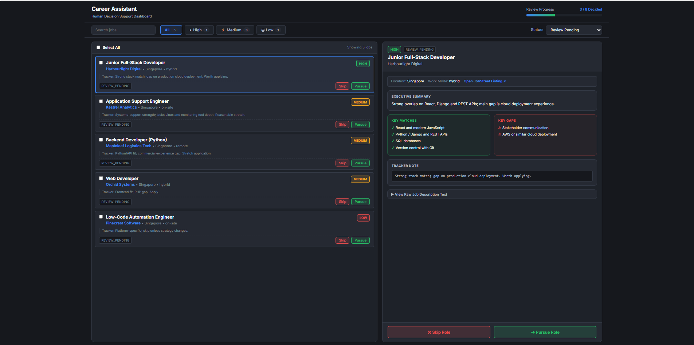
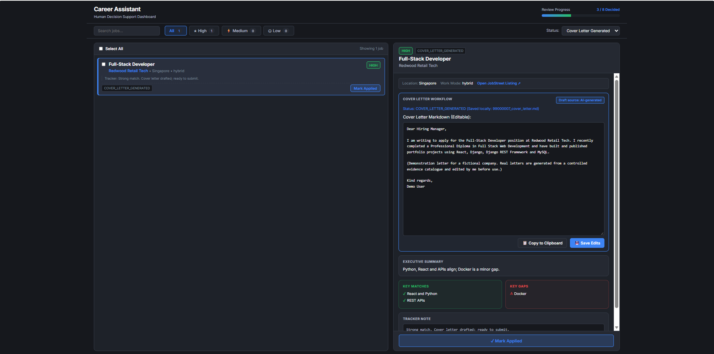
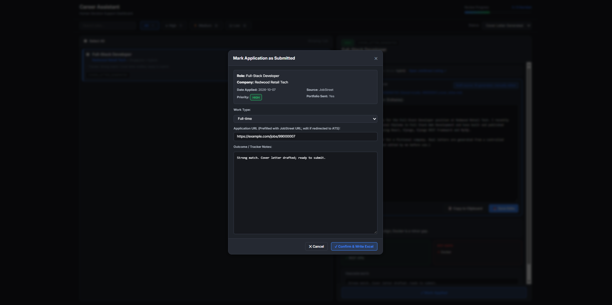
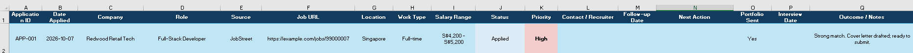

# Career Assistant: Local AI, Human in the Loop

A local, human-in-the-loop assistant for job searching. It reads JobStreet
job-alert emails from Gmail (read-only), retrieves each job page, analyses the
job against a career evidence catalog using a **local** language model, and
presents the results in a review dashboard. You decide what to skip, what to
pursue and what to apply for. The tool records your applications in an Excel
tracker.

It never applies for jobs and never changes your email.

Case study: <https://derekwongha.github.io/projects/localai/>

> **Synthetic data only.** Everything in this repository is fictional: the
> example candidate ("Casey Placeholder"), the companies, the jobs and the
> screenshots. No personal data, credentials or real job records are included.

---

## What it does

1. **Collects** JobStreet job links from Gmail alert emails, using the read-only
   Gmail scope. Missed days are caught up automatically, up to 30 days back.
2. **Deduplicates** jobs by their canonical JobStreet job ID and stores them in a
   local SQLite registry, so a job is never processed twice.
3. **Retrieves** each new job page in a visible Chromium window (Playwright) and
   cleans the page text.
4. **Analyses** each job with **one call** to a local model served by LM Studio,
   grounded in a career evidence catalog you supply. The default is at most 25
   analyses per run, and the remaining backlog continues on the next run.
5. **Lets you review** each job in a local dashboard. You choose Skip or Pursue,
   optionally generate a cover letter draft and edit it, and mark the job applied
   after you have applied yourself.
6. **Records** each application in an Excel tracker.

## Architecture

```
Gmail (read-only) ─▶ JobStreet links ─▶ canonical job-ID dedupe ─▶ SQLite registry
                                                                     │
          LM Studio (127.0.0.1:1234) ◀── one grounded call per job ◀─ Playwright retrieval
                     │                                                 + text cleaning
                     ▼
        priority / action / matches / gaps / tracker note
                     │
                     ▼
     Review dashboard (127.0.0.1:8080) ─▶ Skip / Pursue ─▶ optional cover letter
                     │
                     ▼
         You apply externally ─▶ Mark Applied ─▶ Excel tracker + SQLite
```

- **Python handles the deterministic work:** identity, deduplication, state
  transitions, evidence selection, validation (Pydantic) and tracker writes.
- **The model handles the interpretation:** job requirements, matches, gaps
  and the recommendation.
- **Job lifecycle:** `REVIEW_PENDING → APPLY_PENDING → COVER_LETTER_GENERATED → APPLIED`,
  plus `SKIPPED`. `REVIEW_PENDING → APPLIED` is rejected.
- **Dashboard stack:** vanilla HTML, CSS and JavaScript, served by Python's
  built-in `http.server`.

## Design principles

- **Human in the loop.** The model only recommends. Every state change is a
  click you make, and applications are always submitted by you.
- **Local LLM only.** Job text and career evidence go only to LM Studio on
  `127.0.0.1`. No cloud LLM API is called.
- **Read-only Gmail.** The only OAuth scope requested is
  `https://www.googleapis.com/auth/gmail.readonly`.
- **No invented experience.** The prompts tell the model to use only the
  supplied evidence, and not to upgrade project work to commercial
  experience, listed skills to expertise, or attendance certificates to
  certifications. These are instructions to the model, not guarantees, which is
  why you review every result.

## Requirements

- Windows. The launchers are `.bat` files. The Python code itself is
  plain Python, but other platforms have not been tested.
- Python 3.11
- [LM Studio](https://lmstudio.ai/) with a model loaded and the local server
  running on port 1234. The default model is `openai/gpt-oss-20b`, with the
  context length set to 16384 in LM Studio.
- A Google account and your own Google Cloud OAuth client (see below).

## Setup

```bat
git clone <this repository>
cd career-assistant-public
python -m pip install -r requirements.txt
python -m playwright install chromium
```

### 1. Google OAuth credentials (your own)

1. In the Google Cloud Console, create a project and enable the **Gmail API**.
2. Configure the OAuth consent screen and add your Gmail address as a test user.
3. Create an **OAuth client ID** of type **Desktop app** and download it.
4. Save it as `04_Application/credentials.json`. This file is gitignored.
5. On the first run, a browser window asks you to allow **read-only** Gmail
   access. The resulting `04_Application/token.json` is also gitignored. If the
   token is later expired or revoked, the app starts the authorisation again.

A dedicated job-search Gmail account is recommended. The batch reads every
message in the date range it scans (read-only) to find JobStreet links.

### 2. Environment variables

The code reads these from the process environment. It does **not** load a
`.env` file. `.env.example` lists them all.

| Variable | Purpose | Default |
|---|---|---|
| `CANDIDATE_NAME` | **Set this.** Your name, used in cover-letter prompts and the sign-off | `[Candidate Name]` |
| `CAREER_EVIDENCE_CATALOG` | Path to your evidence catalog JSON | `04_Application/career_evidence_catalog.json` |
| `CAREER_TRACKER_PATH` | Path to your tracker workbook | `data/job_application_tracker.xlsx` |
| `JOB_ANALYSIS_MODEL` | Model name in LM Studio | `openai/gpt-oss-20b` |
| `JOB_ANALYSIS_REASONING_EFFORT` | Reasoning effort sent with each request | `medium` |
| `JOB_ANALYSIS_TIMEOUT_SECONDS` | Request timeout for analysis | `600` |
| `JOB_EXTRACTION_MODEL` / `JOB_EXTRACTION_TIMEOUT_SECONDS` | Used by the extraction module | `openai/gpt-oss-20b` / `300` |
| `JOBSTREET_TEST_URL` | Only for the two manual live retrieval scripts | (none) |

Example in Windows Command Prompt:

```bat
set CANDIDATE_NAME=Your Name
set CAREER_EVIDENCE_CATALOG=%CD%\04_Application\career_evidence_catalog.json
```

### 3. Bring your own evidence catalog

The analysis is grounded in a **career evidence catalog**: a JSON file that
matches the Pydantic schema in `04_Application/career_evidence_schema.py`. Each
item has an ID (`RESUME-…`, `PORTFOLIO-…` or `CAPABILITY_MATRIX-…`), a
capability, an evidence statement, a state and any limitations. All `RESUME-`
items are always included in the analysis prompt. Up to 8 other items are
selected per job by keyword relevance.

This repository does **not** include tools that build a catalog from your
resume. Write your own JSON in the same schema, and keep it at the default path
(gitignored) or point `CAREER_EVIDENCE_CATALOG` at it.

To try the tool first, use the fictional example:

```bat
set CAREER_EVIDENCE_CATALOG=%CD%\examples\synthetic_career_evidence_catalog.json
```

### 4. Create a blank tracker

```bat
python 04_Application\tracker_template.py data\job_application_tracker.xlsx
```

This builds a workbook from scratch with the `Applications` sheet (17 columns,
placeholder rows `APP-001` to `APP-100`), a `Dashboard` sheet and a `Lists`
sheet. The workbook's author metadata is left blank.

## Running

1. Start LM Studio, load the model and start the local server.
2. Double-click **`Run Daily Jobs.bat`**. It:
   - checks that LM Studio is reachable;
   - runs `04_Application/daily_job_batch.py --analyse`;
   - collects new alerts since the last successful run;
   - analyses up to 25 jobs.
   Run it again to continue a larger backlog.
3. Double-click **`Start Career Assistant.bat`** to open the review dashboard at
   <http://127.0.0.1:8080/>.

Other batch options are `--date`, `--start-date` / `--end-date` (explicit
historical range) and `--max-analyses`. See
`python 04_Application\daily_job_batch.py --help`.

Runtime output (the SQLite registry, daily reports and cover letters) is
written under `05_Evaluation/`, which is gitignored.

## Synthetic demo (no Gmail, no LM Studio)

The demo shows the review dashboard with eight fictional jobs, a blank tracker
and one demonstration cover letter:

```bat
examples\demo\Start_Demo_Dashboard.bat
```

or:

```bat
python examples\demo\make_demo.py
python examples\demo\run_demo.py
```

Then open <http://127.0.0.1:8081/>.

The demo data is written to `examples/demo/output/` (gitignored) and uses
paths relative to the repository root. Browsing, Skip and Pursue work without a
model. **Generate cover letter** calls LM Studio.

## Screenshots (synthetic data)

All screenshots show the synthetic demo: fictional companies and jobs only.

| Review queue | Cover letter draft |
|---|---|
|  |  |

| Confirm application | Tracker write-back |
|---|---|
|  |  |

A short demo video is linked from the case study:
<https://derekwongha.github.io/projects/localai/>

## Tests

**Offline tests (no credentials, no network, no model):**

```bat
python -m pytest
```

`pytest.ini` limits collection to these files:

- `job_registry_test.py`
- `missed_day_catchup_test.py`
- `dashboard_server_test.py`
- `step4_deterministic_test.py`
- `step5_deterministic_test.py`
- `excel_tracker_writer_test.py`
- `cover_letter_generator_test.py`
- `job_analysis_reasoner_simplified_test.py`
- `gmail_oauth_recovery_test.py`

They use mocks, temporary SQLite databases, trackers built from scratch, and the
synthetic catalog. `04_Application/conftest.py` points them at the catalog.

**Manual live scripts (run individually; they need credentials or services):**

| Script | Needs |
|---|---|
| `gmail_readonly_test.py`, `gmail_message_content_test.py`, `gmail_url_extraction_test.py`, `gmail_structured_links_test.py`, `gmail_redirect_resolution_test.py`, `gmail_jobstreet_extraction_test.py` | Your `credentials.json` / Gmail access |
| `live_one_call_job_test.py` | Gmail + JobStreet + LM Studio |
| `job_analysis_reasoner_test.py`, `test_lmstudio_connection.py` | LM Studio |
| `job_page_retriever_test.py`, `job_page_browser_test.py` | Playwright + `JOBSTREET_TEST_URL` |
| `job_assessment_evidence_retriever_test.py` | Nothing external (script; uses `CAREER_EVIDENCE_CATALOG`) |

**Results at publication:** `python -m pytest` — 86 passed (Windows, Python 3.11.1,
pytest 9.1.0). The live scripts were not part of this run.

## Limitations

- **JobStreet only.** LinkedIn links are recognised in emails but not processed.
- **Windows launchers.** The `.bat` files are Windows-only. The author has used
  the tool on Windows. Other platforms have not been tested for real use.
- **Requires LM Studio.** Analysis speed depends on your hardware. A 20B model
  on a consumer laptop takes minutes per job, which is why each run is capped.
- **Page structure.** JobStreet retrieval and cleaning depend on the site's
  current page layout and may break if it changes.
- **Evidence catalog required.** You must provide your own catalog. Builders for
  resume or portfolio documents are not included.
- **Advisory output.** The model can misjudge fit. Every recommendation and
  cover letter needs human review.
- **No authentication on the local dashboard.** It binds to `127.0.0.1` only.

## JobStreet: personal use and terms

This tool opens JobStreet job pages that appear in your own alert emails, one at
a time, in a visible browser, for your personal job search. It is not a scraper
for bulk collection. You are responsible for following JobStreet's terms of
use and any applicable laws, and for using the tool at a reasonable pace.

## Security

See [SECURITY.md](SECURITY.md). It lists what is never committed, the network
calls the code makes, and the protections that exist.

## How this was built

Development was **AI-assisted and human-directed**. AI coding assistants
generated much of the code and documentation. The author defined the
requirements and architecture, made the design decisions, reviewed the changes,
ran the tests and used the tool on a real job search.

## License

[MIT](LICENSE) © 2026 Derek Wong
